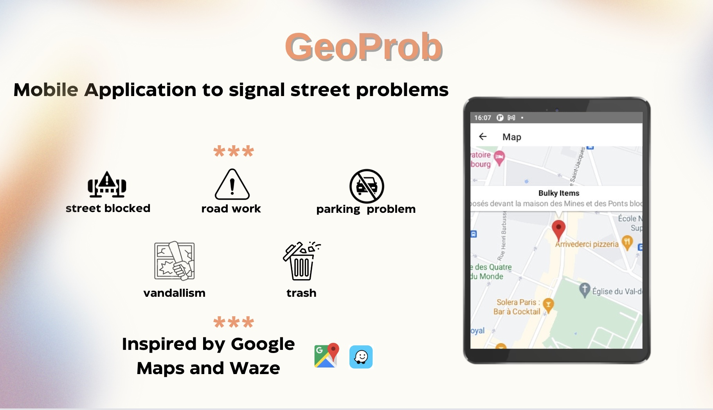

# Projet GeoProb

      ____            ____            _     
     / ___| ___  ___ |  _ \ _ __ ___ | |__  
    | |  _ / _ \/ _ \| |_) | '__/ _ \| '_ \ 
    | |_| |  __/ (_) |  __/| | | (_) | |_) |
     \____|\___|\___/|_|   |_|  \___/|_.__/ 

### Introduction
This application is a street map that allows you to signal issues that you encounter:
- traffic 
- road work
- vandalism
- trash
- demonstrations
- etc..

### Technologies
Backend: 
 - Python - Flask - SQLAlchemy 
 - MakeFile 
 - PostgreSQL
- 

Frontend: React Native - JS 

Developed by Tanguy RENAUDIE at Mines Paris PSL 

  